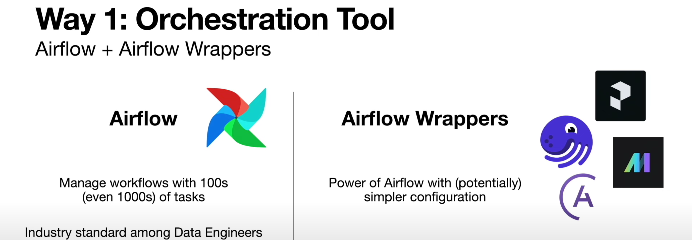
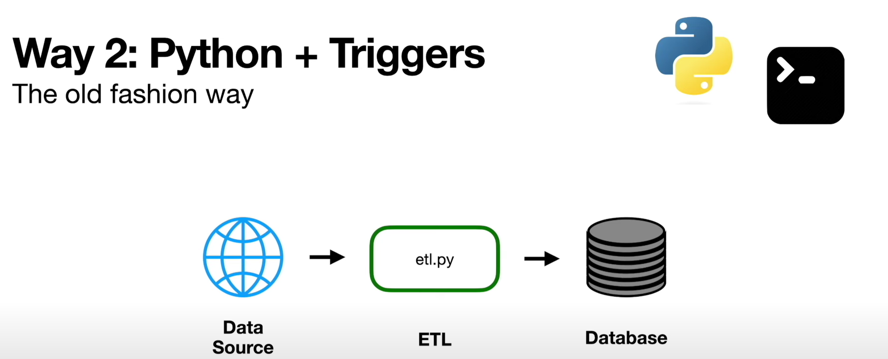
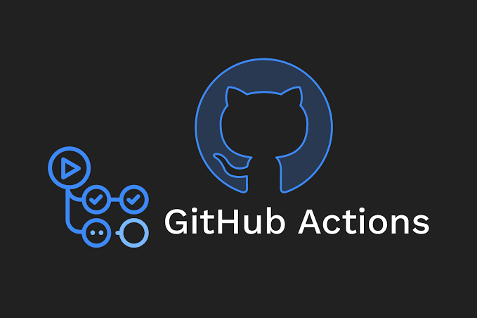

# 🚀 data_pipeline_CICD

This project demonstrates how to build and automate a CI/CD pipeline for data workflows using **GitHub Actions**. With the increasing complexity of data pipelines, automation ensures reliability, reproducibility, and scalability across development, staging, and production environments.

---

## ⚙️ Automating Data Pipelines

There are two key strategies for automating data pipelines: using orchestration platforms and setting up custom scripts with time-based triggers.

### 🧭 1. Orchestration Tools


Modern orchestration platforms help schedule, monitor, and manage pipeline dependencies:

- **Apache Airflow** – Industry standard for DAG-based workflow orchestration.
- **Mage** – A low-code alternative focused on simplicity and rapid development.
- **Dagster** – A data-first orchestrator with solid development tooling and type safety.
- **Astronomer (Astro)** – A commercial platform built on Airflow with managed infrastructure and deployment capabilities.

Each tool can schedule ETL jobs, trigger workflows based on events, and monitor pipeline health.

---

### 🐍 2. Python + Cron Triggers

For lightweight workflows or early-stage projects, Python scripts combined with `cron` jobs are effective.



- Write your ETL logic in a Python script
- Schedule it using cron syntax (e.g., `0 0 * * *` to run at midnight) - use [crontab.guru](https://crontab.guru) to help build cron expressions
- GitHub Actions can act as a managed cron runner without relying on local schedulers or cloud platforms

---

## 🧩 GitHub Actions for CI/CD

GitHub Actions is a native automation platform that allows you to run scripts on GitHub events (push, PR, schedule, etc.).



**Benefits:**
- ⚡ **Free compute** for public repositories and generous limits for private ones
- 🛠️ **Easy to set up** – just create a `.yml` file under `.github/workflows/`
- 🧪 **Test-driven development** – run tests on push, PR, or commit
- 🔐 **Secure with secrets** – manage API keys and tokens in GitHub Settings

---

## 🧪 Example: Automating ETL for YouTube Video Transcripts ➝ Text Embeddings

This end-to-end use case shows how to automate the entire workflow from ingestion to transformation using GitHub Actions.

### 🔄 Workflow Overview

1. **Create ETL Python Script**  
   - Ingest YouTube video metadata and transcripts  
   - Clean and preprocess data  
   - Convert text into vector embeddings using OpenAI or HuggingFace models

2. **Create GitHub Repository**  
   - Push your ETL logic and project structure

3. **Set Up GitHub Actions Workflow**  
   - Create a YAML file like `.github/workflows/etl.yml`  
   - Define triggers (`on: push`, `on: schedule`, etc.)
   - Define job steps (install dependencies, run script)

4. **Add Repo Secrets**  
   - Store API keys like `OPENAI_API_KEY`, `YOUTUBE_API_KEY` using GitHub Secrets  
   - Reference them in your workflow for secure access

5. **Push and Commit**  
   - The workflow is triggered automatically  
   - Your data pipeline runs in the cloud on every change or on a schedule

---

## 📂 Example Workflow File (`etl.yml`)

```yaml
name: Run YouTube ETL

on:
  schedule:
    - cron: '0 0 * * *' # every day at midnight UTC
  push:
    branches:
      - main

jobs:
  run-etl:
    runs-on: ubuntu-latest
    steps:
      - name: Checkout Repo
        uses: actions/checkout@v3

      - name: Set up Python
        uses: actions/setup-python@v4
        with:
          python-version: '3.10'

      - name: Install dependencies
        run: pip install -r requirements.txt

      - name: Run ETL Script
        env:
          OPENAI_API_KEY: ${{ secrets.OPENAI_API_KEY }}
          YOUTUBE_API_KEY: ${{ secrets.YOUTUBE_API_KEY }}
        run: python etl/youtube_etl.py
